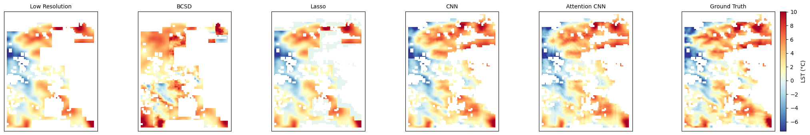
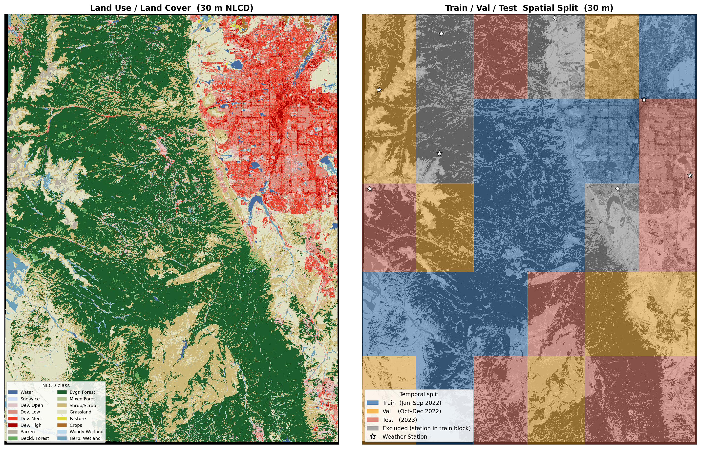

# Downscaling Atmospheric Forcing in Complex Terrain

**Ashwani Rai, Ayush Khot, Harsh Shah, Vishal Ramvelu** — University of Illinois Urbana-Champaign

A GeoAI framework for spatial downscaling of MODIS Land Surface Temperature (LST) over the Colorado Front Range. The pipeline learns to resolve coarse 4 km satellite fields to 1 km — and further to 250 m via a two-stage cascade — by fusing terrain-aware auxiliary predictors (NDVI, DEM, NLCD land cover) with a dual-branch attention-augmented CNN.

[Paper (PDF)](paper/G11_Final_Paper.pdf) | [Presentation (PDF)](paper/G11_Final_Presentation.pdf) | Dataset: [`akhot2/downscaling`](https://huggingface.co/datasets/akhot2/downscaling)

---

## Results

Evaluated on held-out test scenes (2023) against test-split spatial blocks only.


*From left: 4 km LR input, BCSD, Lasso, CNN, Attention CNN, and 1 km ground truth.*


| Method | RMSE ↓ | MAE ↓ | R² ↑ | SSIM ↑ |
|--------|-------:|------:|-----:|-------:|
| BCSD | 20.335 | 20.126 | −40.3 | 0.031 |
| Lasso | 4.791 | 3.887 | −1.146 | 0.506 |
| CNN | 1.097 | 0.856 | **0.944** | **0.475** |
| **ATTN-CNN** | **1.084** | **0.841** | 0.941 | 0.472 |

ATTN-CNN and CNN are compared on 250 m ground-station predictions below (U = urban, F = forested):

| Station | Type | CNN RMSE | ATTN-CNN RMSE |
|---------|------|:--------:|:-------------:|
| Cherry Creek Reservoir | U | 12.52 | **12.25** |
| Chatfield at South Platte | U | **10.65** | 11.03 |
| Boulder South West | U | 9.80 | **9.23** |
| Echo Lake | F | 5.67 | **5.64** |
| Jackwhacker Gulch | F | 7.78 | **7.47** |
| Berthoud Summit | F | **7.13** | 7.24 |
| Lake Eldora | F | **4.91** | 5.05 |

---

## Method

Both deep models share a **dual-branch guided super-resolution** design:

- **LR branch** — residual blocks (with optional SE channel attention) on the 4 km MODIS LST input.
- **HR branch** — residual blocks on the 1 km covariate stack (NDVI + DEM + NLCD one-hot).
- **Fusion** — `GuidedCNN` concatenates bicubic-upsampled LR features with HR features. `AttentionAugmentedCNN` replaces this with a **cross-attention module**: HR features form the query sequence while LR features supply keys and values, letting each output pixel attend directly to relevant coarse-resolution context.
- The network predicts a **residual on top of bicubic upsampling**, so it only learns the high-frequency correction.

A two-stage **cascade** can further downscale from 1 km to 250 m by reusing the same architecture with 250 m covariates.

---

## Repository layout

```
.
├── model/
│   ├── dataset.py          DownscalingDataset + spatial/temporal split logic
│   ├── cnn.py              GuidedCNN — dual-branch baseline
│   └── attention_cnn.py    AttentionAugmentedCNN — adds SE channel + cross-attention
├── notebooks/
│   ├── dataloader_viz.py   Inspect splits, covariates, and sample LR/HR patch pairs
│   ├── visualize_split.py  Plot the temporal + spatial train/val/test split
│   └── colabs/
│       ├── baselines.ipynb        Bicubic, BCSD, Lasso — saves test_scenes.npz
│       ├── cnn_baseline.ipynb     Train GuidedCNN — saves cnn_preds.npz
│       ├── attention_cnn.ipynb    Train AttentionAugmentedCNN — saves attn_preds.npz
│       ├── plots.ipynb            All cross-model comparison figures
│       ├── stations.ipynb         Ground-station validation (SNOTEL / CoAgMET)
│       └── testing.ipynb          Cascade (1 km → 250 m) inference
├── figs/                   Pre-generated figures from the paper
├── paper/                  Final paper and presentation (PDF/PPTX)
├── requirements.txt
├── LICENSE
└── README.md
```

---

## Dataset

Hosted on Hugging Face: [`akhot2/downscaling`](https://huggingface.co/datasets/akhot2/downscaling).

Study domain: 1°×1° AOI over the Colorado Front Range (38.98–39.98 N, 105.82–104.82 W), projected to UTM 13N (EPSG:32613). The region spans the Denver metro area to the Continental Divide, covering urban, agricultural, forested, and alpine tundra land covers.

| Layer | Source | Native resolution | Format | Temporal coverage |
|-------|--------|:-----------------:|--------|:-----------------:|
| MODIS LST (`MOD11A1` v061) | Terra | 1 km | HDF5 | Daily, 2022–2023 |
| NDVI (`MOD13Q1` v6.1) | Terra | 250 m | HDF5 | 16-day composite |
| DEM (ASTGTM v003) | ASTER | 30 m → coarsened to 4 km / 1 km / 250 m | GeoTIFF | Static |
| Land cover (NLCD) | USGS | 30 m | GeoTIFF | Static |
| AOI boundary | — | — | Shapefile | Static |

Despite the `.hdf` extension, the cropped MODIS/NDVI files are HDF5 — read them with `h5py`, not `pyhdf`.

`model/dataset.py` builds an HR (1 km, 112×87 px) and LR (4 km, 28×22 px) reference grid from the pre-coarsened DEM, then reprojects every other layer onto them.

---

## Splits

The split combines a **temporal block** with a **spatial holdout** to prevent both seasonal and spatial autocorrelation leakage:

| Split | Dates | Spatial blocks | Scenes (after cloud filter) |
|-------|-------|:--------------:|:---------------------------:|
| train | Jan–Sep 2022 | 18 / 30 (60 %) | 234 |
| val | Oct–Dec 2022 | 6 / 30 (20 %) | 67 |
| test | 2023 (full year) | 6 / 30 (20 %) | 308 |

Spatial blocks are a 5×6 grid (~22×15 km each), assigned stratified by `(urban-fraction × elevation)` so every split spans both Denver-area developed land and high alpine terrain. Blocks containing SNOTEL/CoAgMET ground stations are excluded from training to prevent data leakage.


*Left: 30 m NLCD land cover. Right: 5×6 spatial block grid colored by split assignment; weather stations (excluded from training) are marked.*

Each sample carries a `valid_mask = (finite LST) ∧ (this split's blocks)`; losses and metrics must be computed under that mask so val/test pixels stay disjoint from train pixels.

---

## Quick start

```bash
pip install -r requirements.txt
```

Data downloads automatically on first use via `huggingface_hub.snapshot_download`:

```python
from model.dataset import DownscalingDataset, get_dataloaders

loaders = get_dataloaders(root="data", batch_size=8)
batch = next(iter(loaders["train"]))
print(batch["lr_lst"].shape, batch["hr_lst"].shape)  # (8,1,28,22)  (8,1,112,87)
```

```python
from model.attention_cnn import AttentionAugmentedCNN, make_hr_cov

n_classes = loaders["train"].dataset.lulc_classes.shape[0]
model = AttentionAugmentedCNN(cov_channels=2 + n_classes)
pred = model(batch["lr_lst"], make_hr_cov(batch))    # (8,1,112,87)
```

---

## Notebooks

Run the colabs in order — each saves `.npz` artifacts that the next notebook consumes.

| Notebook | Description |
|----------|-------------|
| [](https://colab.research.google.com/github/fresleven/downscaling/blob/main/notebooks/colabs/baselines.ipynb) | `baselines.ipynb` — bicubic, BCSD, Lasso |
| [](https://colab.research.google.com/github/fresleven/downscaling/blob/main/notebooks/colabs/cnn_baseline.ipynb) | `cnn_baseline.ipynb` — train `GuidedCNN` |
| [](https://colab.research.google.com/github/fresleven/downscaling/blob/main/notebooks/colabs/attention_cnn.ipynb) | `attention_cnn.ipynb` — train `AttentionAugmentedCNN` |
| [](https://colab.research.google.com/github/fresleven/downscaling/blob/main/notebooks/colabs/plots.ipynb) | `plots.ipynb` — cross-model comparison figures |
| [](https://colab.research.google.com/github/fresleven/downscaling/blob/main/notebooks/colabs/stations.ipynb) | `stations.ipynb` — SNOTEL/CoAgMET ground-station validation |
| [](https://colab.research.google.com/github/fresleven/downscaling/blob/main/notebooks/colabs/testing.ipynb) | `testing.ipynb` — two-stage cascade to 250 m |

`notebooks/dataloader_viz.py` and `notebooks/visualize_split.py` are scripts (open as Jupyter notebooks via `# %%` cell markers) for inspecting the dataset splits and sample patches locally.

---

## License

MIT.
